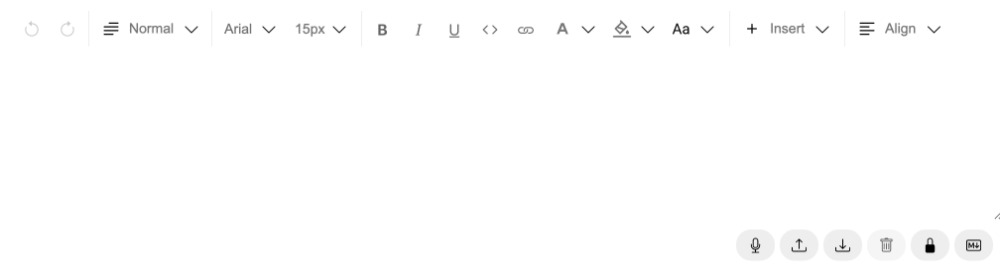

# Verbum

Verbum - Flexible Text Editor for React

**Verbum** is a fully flexible rich text editor based on [`lexical-playground`](https://github.com/facebook/lexical/tree/main/packages/lexical-playground) and [`lexical`](https://github.com/facebook/lexical) framework.

**⚠️ As the Lexical framework is currently in early development, this component library is also likely to change quite often**

## Installation

```
npm install verbum --save
```

## Demo


Live demo is coming soon...

## Usage

```js
import { FC } from 'react';
import {
  EditorComposer,
  Editor,
  ToolbarPlugin,
  AlignDropdown,
  BackgroundColorPicker,
  BoldButton,
  CodeFormatButton,
  FloatingLinkEditor,
  FontFamilyDropdown,
  FontSizeDropdown,
  InsertDropdown,
  InsertLinkButton,
  ItalicButton,
  TextColorPicker,
  TextFormatDropdown,
  UnderlineButton,
  Divider,
} from 'verbum';

const NoteViewer: FC = () => {
  return (
    <EditorComposer>
      <Editor hashtagsEnabled={true}>
        <ToolbarPlugin defaultFontSize="20px">
          <FontFamilyDropdown />
          <FontSizeDropdown />
          <Divider />
          <BoldButton />
          <ItalicButton />
          <UnderlineButton />
          <CodeFormatButton />
          <InsertLinkButton />
          <TextColorPicker />
          <BackgroundColorPicker />
          <TextFormatDropdown />
          <Divider />
          <InsertDropdown enablePoll={true} />
          <Divider />
          <AlignDropdown />
        </ToolbarPlugin>
      </Editor>
    </EditorComposer>
  );
};

export default NoteViewer;
```

<!-- ## Examples

Coming soon... -->

<!--
## Styling components

Coming soon... -->

## API

`<EditorComposer />`

| Property           | Type              |          | description                                                                        |
| ------------------ | ----------------- | -------- | ---------------------------------------------------------------------------------- |
| children           | `ReactNode`       | required | Nested child component which is the Editor itself                                  |
| initialEditorState | `InitialEditorStateType` | optional | The initial state of the editor                                             |

<br />

`<Editor />`

| Property           | Type              |          | description                                                                        |
| ------------------ | ----------------- | -------- | ---------------------------------------------------------------------------------- |
| children           | `ReactNode`       | optional | Nested child components, like the `ToolbarPlugin`                                  |
| hashtagsEnabled    | `boolean`         | optional | Enables the automatic hashtag highlighting, default is `false`                     |
| autoLinkEnabled    | `boolean`         | optional | Enables the automatic link highlighting, default is `false`                        |
| emojisEnabled      | `boolean`         | optional | Replaces the emoji combiniations with its corresponding symbol, default is `false` |
| actionsEnabled     | `boolean`         | optional | Enables the actions toolbar, default is `false`                                    |
| placeholder        | `string`          | optional | The default content of the editor when it is first loaded                          |
| listMaxIndent      | `number`          | optional | The maximum indent capacity of any listed element, the default is `7`              |
| isEditable         | `boolean`         | optional | Enables read-only mode for the editor, default is `false`                          |
| initialEditorState | `string`          | optional | JSON string to initialize the initial content of the editor.                       |
| onChange           | `(editorState: string, editorInstance?: LexicalEditor) => void` | optional | Accessing the current editor state and the active editor instance                                                 |
| locale  | `en | fr | null` | optional | Enables localization in the language of your choice, default is `en`. Available languages are `en` and `fr` |

## Automatic browser language detection Support

Verbum supports automatic browser language detection by default if locale not provided. If the browser language is set to `fr`, the editor will be automatically localized in French. If the browser language is set to `en`, the editor will be automatically localized in English. If the browser language is set to any other language, the editor will be automatically localized in English.

<br />

`<ToolbarPlugin />`

| Property          | Type                   |          | description                                                                                      |
| ----------------- | ---------------------- | -------- | ------------------------------------------------------------------------------------------------ |
| children          | `React.ReactElement[]` | optional | Nested child components, like the `InsertDropdown`                                               |
| defaultFontSize   | `string`               | optional | The default font size selected when the editor first loaded, default value is `15px`             |
| defaultFontColor  | `string`               | optional | The default font color selected when the editor first loaded, default value is `#000`            |
| defaultBgColor    | `string`               | optional | The default text background color selected when the editor first loaded, default value is `#fff` |
| defaultFontFamily | `string`               | optional | The default font family selected when the editor first loaded, default value is `Arial`          |

<br />

  <!-- enableTable?: boolean;
  enableYoutube?: boolean;
  enableTwitter?: boolean;
  enablePoll?: boolean;
  enableImage?: boolean;
  enableEquations?: boolean;
  enableExcalidraw?: boolean;
  enableHorizontalRule?: boolean;
  enableStickyNote?: boolean; -->

`<InsertDropdown />`

| Property             | Type      |          | description                                      |
| -------------------- | --------- | -------- | ------------------------------------------------ |
| enableTable          | `boolean` | optional | Enables table inserting feature                  |
| enableYoutube        | `boolean` | optional | Enables youtube video inserting feature          |
| enableTwitter        | `boolean` | optional | Enables tweet inserting feature                  |
| enablePoll           | `boolean` | optional | Enables poll inserting feature                   |
| enableImage          | `boolean` | optional | Enables image inserting feature                  |
| enableEquations      | `boolean` | optional | Enables equation inserting feature               |
| enableExcalidraw     | `boolean` | optional | Enables diagram inserting feature                |
| enableHorizontalRule | `boolean` | optional | Enables the horizontal rule inserting for layout |
| enableStickyNote     | `boolean` | optional | Enables stick note inserting for layout          |

## Development

For development use:

```
$ npm install (in case of an error, run `npm install --legacy-peer-deps`)
$ npm start
```

Also you can test it locally using Storybook:

```
$ npm run storybook
```

## Future plans

- Test coverage
- ~~Programmatic access to the editor input as JSON~~
- ~~Localization~~
- Ready templates with different options (MUI, Bootstrap, etc...)
- Dark/Light modes
- Custom styling flexibility
- ~~Disassembling all of the toolbar to enable using them as nested components, increasing the flexibility~~
- ~~Enabling adjusting editor settings such read-only mode and etc. programmatically~~

## License

Licensed under MIT License.
